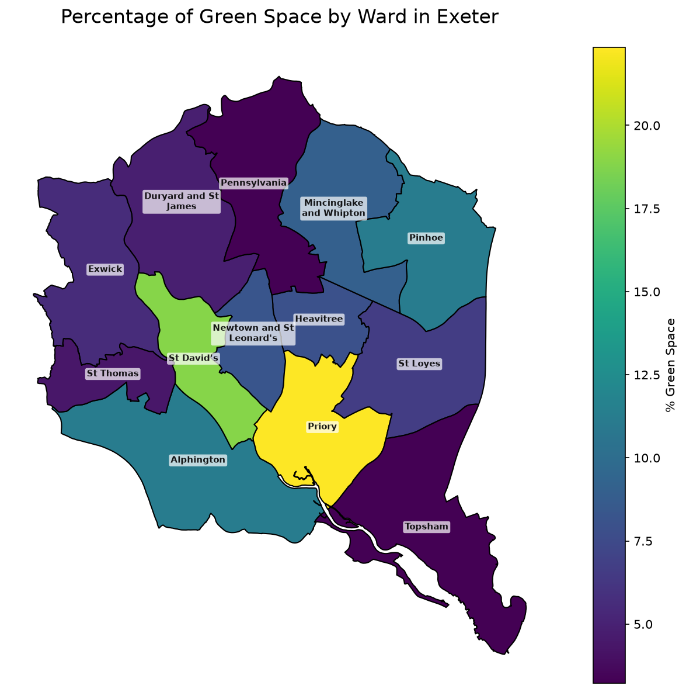

# Mapping Green Space in Exeter

Which Exeter ward has the least mapped green space? It depends on how you measure it.



## Overview

This project analyses green-space availability across Exeter's wards, using May 2025 ward boundaries and Census 2021 population data (table TS001). It calculates green-space area, the percentage of each ward covered by selected green-space features, and green space per resident, to explore how access to mapped green areas varies across the city.

This is my first project using the GeoPandas library. My aim was to become more familiar with the library in preparation for my 3rd Year Literature Review and Project. I wanted to apply GeoPandas to something practical and relevant to my day-to-day life, by analysing the distribution of green space in Exeter's wards, and identifying under-provided wards. I also wanted to explore a variety of spatial data science and mapping techniques.

## Data Sources

- **Ward boundaries** — May 2025 UK wards, from the ONS boundary dataset via the UK Government's ArcGIS FeatureServer
- **Green space features** — OpenStreetMap, accessed via `osmnx` (`leisure=park`, `leisure=garden`, `landuse=grass`)
- **Population** — Census 2021, table TS001, via the [nomis API](https://www.nomisweb.co.uk/)

## Method

- Ward boundaries and OSM green-space features are both reprojected to EPSG:27700 (British National Grid) so that area calculations are in metres, not degrees
- Green-space polygons are clipped to ward boundaries using a spatial overlay (`gpd.overlay`, intersection) rather than assigning each polygon wholesale to a single ward — this avoids double-counting green space that crosses ward borders, and avoids the distortion of assigning an entire polygon to whichever ward contains its centroid
- Three normalised metrics are calculated per ward: total green-space area, green space as a percentage of ward area, and green space per resident — using three metrics rather than one, since ward size and population vary enough that any single measure is misleading on its own
- Choropleths are shown both as continuous (unclassed) colour scales and using Jenks natural-breaks classification (`mapclassify`, k=5), to compare how classification choice affects legibility versus outlier visibility
- A kernel density estimate (`scipy.stats.gaussian_kde`) shows the spatial concentration of green-space features independent of ward boundaries, in both static (matplotlib) and interactive (`folium`) form

## Key Findings

- Priory tops all three measures related to green space: highest total area, highest percentage, and highest green space per person. This makes sense considering Priory's relatively small population, and the fact that it's a suburban, residential area, that's also home to Ludwell Valley Park and King George V Playing Fields.
- When comparing Alphington with St David's, Alphington has more total green space area (0.63 vs 0.47 km²) and more green space per person (76 vs 44), but St David's actually has a higher percentage of green space (18.8% vs 11.2%). This is partly explained by ward size: St David's ward is only 2.48 km², less than half Alphington's 5.66 km², so a smaller amount of green space still makes up a larger share of the ward overall.
- Similarly, St Thomas is ranked at the bottom for overall green space area, and green space area per person. However, it's not quite bottom for percentage: that's Topsham, with 3.2% compared to St Thomas' 4.4%. Topsham also has decent green space per person (17.8), despite the lowest percentage. This comes down to area rather than population: Topsham is much larger than St Thomas, so despite having a similar number of residents, its green space is spread out across a much bigger ward.
- Duryard and St James has by far the highest population (15,147, nearly 50% more than the next-highest ward), but mid-table green area per person. This is likely due to the fact that this ward is a dense residential area, especially in terms of students. It contains the University of Exeter and its on-campus accommodation, as well as a large amount of private student housing nearby.

## Limitations

This analysis measures mapped green-space features, not physical access or quality. OpenStreetMap coverage and tagging can vary between wards, and the selected tags exclude some spaces while including areas that may not be publicly accessible. The heatmap shows the density of mapped features rather than their total area or accessibility.

The population data is from Census 2021, while the ward boundaries are from May 2025 — a reasonable exploratory comparison, but population estimates aligned to the boundary vintage would make the per-resident measure more consistent. A stronger follow-up would validate the selected features against a local parks dataset, resolve overlaps between OSM polygons where necessary, and compare results against walking-distance or travel-time access measures.

## Repo Structure

```text
geopandas_project.ipynb
requirements.txt
README.md
images/
└── pct_green_natural_breaks.png
```

## Running It

1. Clone the repo and install dependencies from the project root:

```bash
git clone <repo-url>
cd geopandas-project
pip install -r requirements.txt
```

2. Open and run `geopandas_project.ipynb` from top to bottom.
3. The ward-boundary download tries the ArcGIS FeatureServer first and falls back to a local GeoPackage if that file is present in the working directory and the service is unreachable.
4. No API key is required for any of the data sources or map tiles used in this project.

This notebook typically takes a few minutes to run, depending on network connectivity and the data download step.

## Tech Stack

`geopandas` · `osmnx` · `pandas` / `numpy` · `matplotlib` · `mapclassify` · `folium` · `scipy`